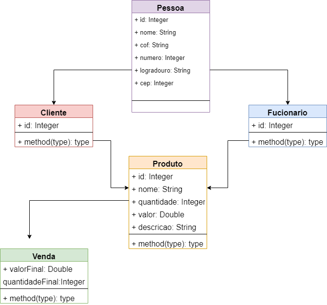

# Beca Desafio João Victor Barreto Lourenço

Diagrama.

Developing  ⚠️
 
### Essa é uma aplicação feita por mim, referente ao desafio da BECA JAVA.

## Conceito e modelagem aplicado.

+ POO
+ UML
+ Estruturação de dados
+ Versionamento da aplicação

## Tecnologia é Ferramentas.

* JAVA 13
* Spring Boot 2.6.2
* Intellij IDE 2021.3.1
* Git
* Docker 4.4.0

## Função.

+ Principal função do projeto é ser um PDV.
+ Adicionar produtos.
+ Receber cadastro de Clientes.
+ Oferecer a venda final.

## Modulos Do Desafio.

* Moduloi 1 - Criação do repositorio é classes.

* Modulo 2 - criação dos controllers é OpenApi
com implementação do response endity.

* Mdoulo 3 - Criação de servies é interfaces com
integração com controller.

* modulo 4 - Criação dos repository é configurando o
banco de dadosH2.

* Modulo 5 - Inserindo o conteito Dto é ralacionamento de tabela.

* Modulo 6 - Mapeando DTs a APi com Mappers.

 
* Modulo 7 - Tratamento de exception.

 
* Modulo 8 - Criando de container com docker.

